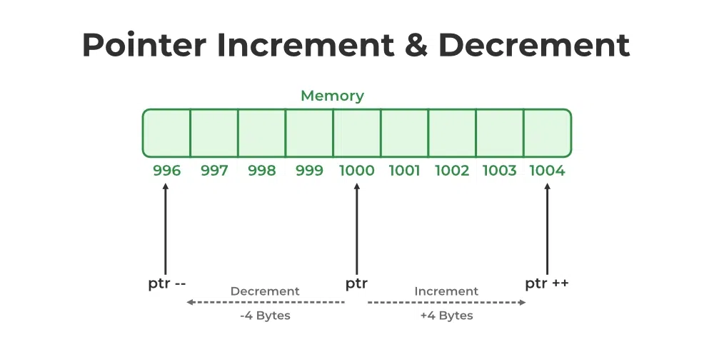

# Punteros


Los punteros son el tema que define si entendés C o no. Y en esta materia son ineludibles: como vas a
ver en el módulo 01, **un registro de hardware es literalmente una dirección fija de memoria a la que
se accede por puntero**, así que cada vez que configures un periférico vas a estar usando esto.

En este capítulo vemos qué es un puntero, los operadores `&` y `*`, la aritmética de punteros y cómo
se llevan con los distintos tipos de datos, marcando las buenas prácticas y los errores clásicos (que
en un micro no terminan en un mensaje de error, sino en un *HardFault* o en un bug silencioso). Lo que
sigue (arreglos y *decay*, cadenas, punteros a función) está en el
[capítulo 09](./09-punteros-avanzado.md).


## ¿Qué es un puntero?

Un puntero en C es, fundamentalmente, una variable que almacena la dirección de otra variable.  
Cada variable en un programa en ejecución se guarda en una ubicación específica de memoria. Esta ubicación tiene una dirección (en general expresada como un número hexadecimal). Un puntero guarda esa dirección.  Esto permite la manipulación de memoria a bajo nivel y más adelante veremos como nos permite un manejo eficiente de arreglos y cadenas de caracteres en C.

> **IMPORTANTE**
>
> - El tamaño de un puntero es fijo para cualquier tipo de dato, y depende de la arquitectura del procesador. En los ARM Cortex-M3, los punteros son de 32 bits (4 bytes).

## Declaración e inicialización de punteros

Para usar punteros, primero debemos declararlos.
Una declaración de puntero especifica el tipo de dato al que apuntará, seguido de un asterisco `*` y el nombre del puntero.
La forma general es:

```c
data_type *nombre_puntero;
```


> **El tipo es importante:** A los punteros se les asigna un tipo de dato, que es el tipo de dato de la variable a la que apuntan. Esto es importante, porque el compilador sabe cuántos bytes debe leer o escribir en memoria cuando se desreferencia el puntero.

Un `int*` solo puede apuntar a un entero (o al primer elemento de un arreglo de enteros), un `char*` a un carácter, y así sucesivamente.


### Ejemplo

Por ejemplo, si tenemos una variable entera `num` almacenada en la dirección de memoria `0x10000004`, un puntero podría contener el valor `0x10000004` para “apuntar” a `num`.

```c
int num = 42;
int *ptr;
ptr = &num;

printf("El valor de num es: %d\n", num);
printf("La dirección de num es: %p\n", (void *)&num);
printf("El valor de ptr es: %p\n", (void *)ptr);
printf("El valor al que apunta ptr es: %d\n", *ptr);
```

Resultado:
```console
El valor de num es: 42
La dirección de num es: 0x10000004
El valor de ptr es: 0x10000004
El valor al que apunta ptr es: 42
```

> Las direcciones del ejemplo empiezan en `0x1000_0000` porque es donde arranca la **SRAM** del
> LPC1769: ahí viven las variables. El mapa completo está en
> [10 - Dónde vive cada variable](./10-donde-vive-cada-variable.md#las-dos-memorias-del-micro).
> Y fijate el cast a `void *` en los `printf`: `%p` espera exactamente ese tipo.

En este fragmento, `int *ptr;` declara `ptr` como un puntero a entero. 

La instrucción `ptr = &num;` asigna a `ptr` la dirección de `num` (usando el operador de dirección `&`). Ahora decimos que “`ptr` apunta a `num`”.


Luego imprimimos `ptr` (con el especificador de formato `%p` para direcciones).

 
### Punteros sin inicializar

Cuando un puntero se declara, no apunta automáticamente a algo significativo. Si simplemente escribimos `int *ptr;` dentro de una función, `ptr` contendrá una dirección basura indefinida hasta que lo inicialicemos.


> **IMPORTANTE**
>
> Usar un puntero sin inicializar es un error grave: se le llama  *wild pointer*, porque apunta a una ubicación de memoria aleatoria.
>
> Desreferenciar un puntero sin inicializar (acceder a la memoria a la que apunta) puede bloquear el programa o corromper datos.
>
> **Por eso, siempre se debe inicializar un puntero antes de usarlo.**

---

## Operadores de puntero: `&` y `*`

Después de inicializar un puntero, este puede usarse para referirse a la variable o al bloque de memoria al que apunta.
En este momento, es importante entender dos operadores clave:

* **`&` (address-of):** colocado antes de una variable (ej., `&var`) devuelve la dirección de memoria de esa variable.
  Lo usamos para obtener direcciones que podamos asignar a punteros.

* **`*` (dereferencia):** colocado antes de un puntero (ej., `*ptr`) accede al valor almacenado en la dirección contenida en el puntero.

En la **declaración**, el `*` va entre el tipo y el nombre. Dónde pongas los espacios es indistinto
para el compilador: las tres formas siguientes declaran exactamente lo mismo.

```c
int* ptr;
int * ptr;
int *ptr;    // la más habitual, y la que conviene adoptar
```

> [!WARNING]
> **El `*` se aplica a un solo nombre, no al tipo.** Por eso, si declarás varias variables en la
> misma línea, esto **no** hace lo que parece:
>
> ```c
> int* a, b;    // a es int*, pero b es un int común (¡no un puntero!)
> ```
>
> Escribirlo como `int *a, b;` deja el problema a la vista, y es la razón por la que la mayoría de
> las guías de estilo pegan el `*` al nombre. Lo más seguro es **una declaración por línea**:
>
> ```c
> int *a;
> int *b;
> ```


---

## Desreferenciando punteros (accediendo a valores apuntados)

Una vez que un puntero tiene una dirección válida, podés usar el operador de desreferencia `*` para acceder o modificar el dato en esa dirección.
Desreferenciar significa “seguir” el puntero hasta su ubicación y tratarla como una variable.
Por ejemplo:

```c
int num = 10;
int *ptr = &num;
printf("%d\n", *ptr);  // imprime 10, el valor de num
*ptr = 20;             // modifica el valor en la dirección de ptr, es decir, cambia num a 20
printf("%d\n", num);   // imprime 20, confirmando que num cambió vía el puntero
```

Esto muestra cómo los punteros permiten leer y escribir variables de forma indirecta.
En este caso, tanto `num` como `*ptr` se refieren a la misma variable.


> **RESUMEN**
> 
> Los operadores `&` y `*` son inversos entre sí:  
> Si `ptr = &var;` ---> entonces `*ptr` es `var`.   

 
## Aritmética de punteros

Los punteros no se usan solo para variables individuales; también podés hacer operaciones aritméticas con ellos para moverte por la memoria. Esto es especialmente útil con arreglos (tema que veremos después).  

En C, la **aritmética de punteros** está definida como operaciones que mueven el puntero para apuntar a otras ubicaciones de memoria relativas a la actual.  
Sin embargo, no se comporta como la aritmética de enteros normal: **está escalada por el tamaño del tipo de dato al que apunta el puntero**.

Por ejemplo, supongamos que `ptr` es un `int*` que guarda la dirección `0x1000`.  
En un sistema de 32 bits, un `int` ocupa 4 bytes, así que:

- `ptr + 1` → dirección `0x1004` (siguiente entero en memoria)  
- `ptr + 2` → dirección `0x1008` (dos enteros adelante)  




- En general, `ptr + n` mueve el puntero hacia adelante **n elementos** (no bytes) de su tipo.  
- Del mismo modo, `ptr - n` lo mueve hacia atrás **n elementos**.  
- El compilador hace este escalado automáticamente en función del tipo de puntero.

Ejemplos por tipo de dato:

- Si `ptr` es un `char*` (1 byte por elemento), `ptr + 1` avanza 1 byte.  
- Si `ptr` es un `double*` (8 bytes por elemento en la mayoría de sistemas), `ptr + 1` salta 8 bytes.

---

### Operaciones válidas con punteros

- **Incremento y decremento:**  
  `p++` o `++p` avanza al siguiente elemento,  
  `p--` retrocede al elemento anterior.

- **Suma y resta de un entero:**  
  `p + n` o `p - n` mueve el puntero **n elementos** hacia adelante o atrás (el desplazamiento se escala por el tamaño del tipo apuntado).

- **Resta entre punteros:**  
  La resta entre punteros es válida si ambos son del mismo tipo **y apuntan a elementos del mismo
  arreglo**. El resultado es el número de elementos entre los punteros (no es el número de bytes).

Por ejemplo: si tenemos dos punteros tipo `int*`, `ptr1` (dirección `0x1000`) y `ptr2` (dirección
`0x1004`), la diferencia entre direcciones es de 4 bytes. Como un `int` ocupa 4 bytes, `ptr2 - ptr1`
vale **1**: un elemento de distancia.

> El resultado de restar dos punteros es de tipo **`ptrdiff_t`** (definido en `<stddef.h>`), que
> tiene signo: `ptr1 - ptr2` daría `-1`. Para imprimirlo, el especificador correcto es **`%td`**, no
> `%d` ni `%ld`.
>
> Restar punteros que apuntan a **arreglos distintos** compila sin chistar, pero es **comportamiento
> indefinido**: el resultado no significa nada.

 
---

### Operaciones no permitidas
No podés multiplicar, dividir o sumar dos punteros. Estas operaciones no tienen sentido conceptual para direcciones y C generará un error de compilación.

---

### Ejemplo

```c
int arr[5] = {10, 20, 30, 40, 50};
int *p = arr;        // apunta a arr[0]
int *q = arr + 3;    // apunta a arr[3] (valor 40)

printf("%d\n", *p);        // imprime 10 (arr[0])
p++;                       // avanza al siguiente elemento
printf("%d\n", *p);        // imprime 20 (arr[1])
printf("%td\n", q - p);    // imprime 2 (cant. de elementos entre arr[1] y arr[3])
```

 
La aritmética de punteros es muy usada en bucles para recorrer arreglos o buffers, a menudo combinada con desreferencia (`*(p + i)` es equivalente a `p[i]`).  

> **PRECAUCIÓN**
>
> Si te salís de los límites del arreglo (por ejemplo, avanzás más allá de su rango válido), el puntero ya no apunta a memoria legítima y desreferenciarlo es **comportamiento indefinido**. Es el origen de los *buffer overflow*.
>
> La única excepción que el estándar permite es calcular el puntero **una posición más allá del
> último elemento** (`arr + N`): se puede calcular y comparar, pero **no desreferenciar**. Es lo que
> hace legal el patrón de recorrido `for (p = arr; p < arr + N; p++)`.
>
> C **no** hace verificación de límites, ni en compilación ni en ejecución.

---

## `NULL`: el puntero que no apunta a nada

A veces necesitamos un puntero que explícitamente **no apunte a ningún lado**. Para eso existe `NULL`, una constante (definida en `<stddef.h>`, `<stdio.h>` y otros headers) que vale `0` y representa "puntero inválido / vacío".

```c
int *p = NULL;   // p no apunta a nada todavía
```

La gran ventaja es que `NULL` se puede **comprobar**. En vez de tener un puntero basura (*wild pointer*) que no sabemos a dónde apunta, un puntero en `NULL` se puede chequear antes de usarlo:

```c
if (p != NULL) {
    *p = 10;     // solo desreferenciamos si p es válido
}
```

> **PRECAUCIÓN**
>
> Desreferenciar un puntero `NULL` (`*p` cuando `p == NULL`) es **comportamiento indefinido**, y lo que pasa en la práctica es muy distinto en una PC que en el micro.
>
> En una PC hay una MMU y la página de la dirección 0 **no está mapeada**: el acceso falla al instante con un *segmentation fault*. Molesto, pero es una bendición: el bug se anuncia solo, en el momento exacto.
>
> En el LPC1769 no hay nada de eso. La dirección `0x00000000` es el **inicio de la Flash**, donde vive la tabla de vectores. Entonces **leer `*p` con `p == NULL` no falla**: te devuelve la primera palabra de esa tabla —el valor inicial del stack pointer— como si fuera un dato válido. Te llevás un número plausible, el programa sigue andando y el error aparece mucho después, en otro lado. Escribir es distinto: la Flash no se escribe con un `str` común, así que ahí normalmente sí terminás en un *HardFault*.
>
> La moraleja es la que importa: **en el micro, el puntero nulo no te avisa.** Chequealo vos.

Un patrón muy común en funciones que reciben punteros (por ejemplo, drivers) es validar la entrada:

```c
void uart_send(const uint8_t *data, uint32_t len) {
    if (data == NULL || len == 0) {
        return;          // no hay nada que enviar; evitamos el crash
    }
    // ... enviar data ...
}
```

---

## `const` y punteros (const-correctness)

Esta es una de las partes más importantes de los punteros para programar microcontroladores, y casi siempre se explica mal. La clave: **`const` puede aplicarse al dato apuntado, al puntero en sí, o a ambos**, y son cosas distintas.

La regla para leer una declaración es **de derecha a izquierda**, empezando por el nombre de la variable:

```c
const uint32_t *p;          // p: puntero a (uint32_t const) -> el DATO es const
uint32_t * const p;         // p: const puntero a uint32_t   -> el PUNTERO es const
const uint32_t * const p;   // p: const puntero a (uint32_t const) -> ambos const
```

Veámoslos uno por uno.

**1. Puntero a dato constante: `const uint32_t *p`**

Podés mover el puntero, pero **no podés modificar el valor apuntado a través de él**.

```c
uint32_t x = 5, y = 9;
const uint32_t *p = &x;

p = &y;        // OK: el puntero se puede reasignar
*p = 100;      // ERROR de compilación: el dato es de solo lectura vía p
```

Esto es lo que ves en la firma de `strlen(const char *s)`: la función promete que **no va a tocar** la cadena que le pasás. Es una garantía documentada y verificada por el compilador.

**2. Puntero constante: `uint32_t * const p`**

El puntero **siempre apunta al mismo lado** (no se puede reasignar), pero sí podés modificar el dato apuntado.

```c
uint32_t x = 5, y = 9;
uint32_t * const p = &x;

*p = 100;      // OK: modificamos x a través de p
p = &y;        // ERROR de compilación: p no se puede reasignar
```

**3. Ambos constantes: `const uint32_t * const p`**

Ni se reasigna el puntero ni se modifica el dato a través de él.

```c
const uint32_t * const p = &x;
*p = 100;      // ERROR
p = &y;        // ERROR
```

> **¿Por qué importa tanto en embebido?**
>
> Por los **registros de hardware**. Un registro de **solo lectura** (por ejemplo, un registro de estado o un buffer de recepción) se modela como puntero a `volatile` **y** `const`:
> ```c
> // Registro de estado de solo lectura en 0x40000000
> volatile const uint32_t * const STATUS = (volatile const uint32_t *)0x40000000;
> uint32_t s = *STATUS;   // OK: leer
> *STATUS = 0;            // ERROR de compilación: es de solo lectura, te frena el compilador
> ```
> El `const` (sobre el dato) hace que el compilador **te avise si intentás escribir** un registro que el hardware no deja escribir; el `volatile` hace que **siempre lo lea de memoria** y no lo cachee en un registro de la CPU. Esta combinación `volatile const` la vas a ver mucho en headers de CMSIS. Lo desarrollamos en el módulo [12 - `volatile` y tipos para hardware](./12-volatile-y-tipos-para-hardware.md).

> **Para los curiosos (avanzado)**
>
> El orden importa: `const` aplica al tipo que tiene **a su izquierda**, salvo que sea lo primero, en cuyo caso aplica al de la derecha. Por eso `const uint32_t *p` y `uint32_t const *p` son **idénticos** (las dos formas son "puntero a uint32_t const"). En cambio, el `const` que está **después del `*`** siempre se refiere al puntero. Una forma infalible de no marearte: leé siempre de derecha a izquierda partiendo del nombre, y tratá al `*` como la palabra "puntero a".

---

## Punteros `void *` y casts

Un puntero `void *` es un **puntero genérico**: puede guardar la dirección de cualquier tipo, pero **no se puede desreferenciar directamente** (el compilador no sabe cuántos bytes leer ni cómo interpretarlos). Antes de usarlo hay que convertirlo (*cast*) al tipo concreto.

```c
int x = 42;
void *vp = &x;        // OK: void* acepta cualquier dirección

// *vp = 1;           // ERROR: no se puede desreferenciar un void*
int *ip = (int *)vp;  // cast al tipo correcto
printf("%d\n", *ip);  // OK: imprime 42
```

¿Para qué sirve? Para escribir funciones **genéricas** que trabajan con memoria sin importar el tipo. El ejemplo clásico es `memcpy`, que copia bytes crudos:

```c
void *memcpy(void *dest, const void *src, size_t n);
```

En embebido aparece muchísimo en los **callbacks**: un driver te deja registrar un puntero `void *` con "contexto del usuario" que te devuelve cuando llama tu función, sin que el driver tenga que saber qué tipo es (lo vemos en [09 - Punteros avanzados](./09-punteros-avanzado.md#punteros-a-función-y-callbacks)).

> **PRECAUCIÓN**
>
> Convertir una dirección a un tipo con requisitos de **alineación** más estrictos es peligroso en Cortex-M3. Por ejemplo, castear un `uint8_t *` que apunta a una dirección impar hacia un `uint32_t *` y desreferenciarlo puede provocar un fallo o una lectura incorrecta. El acceso desalineado, el *padding* y la alineación de estructuras están en [13 - Structs para hardware](./13-structs-para-hardware.md).

---

## Punteros colgantes (*dangling pointers*)

Un **puntero colgante** es un puntero que apunta a memoria que **ya no es válida**. El caso más peligroso y frecuente en C: **devolver la dirección de una variable local**.

```c
int *funcion_rota(void) {
    int local = 42;
    return &local;     // MAL: local deja de existir al volver de la función
}                      // la dirección devuelta apunta a basura (stack reutilizado)
```

Cuando la función retorna, su *stack frame* se libera y `local` deja de existir. El puntero devuelto sigue teniendo la dirección, pero esa memoria se reutiliza para la siguiente llamada, así que leerla o escribirla es **comportamiento indefinido**. (El mecanismo completo —qué es un *stack frame*, por qué "liberarlo" es solo mover un puntero y por qué a veces el bug *parece* no existir— está en [10 - Dónde vive cada variable](./10-donde-vive-cada-variable.md).)

Soluciones correctas:

```c
// Opción A: el llamador provee el espacio (patrón muy usado en embebido)
void funcion_ok(int *out) {
    *out = 42;         // escribimos en memoria del llamador
}

// Opción B: usar una variable static (vive todo el programa) -- ojo, no es reentrante
int *funcion_static(void) {
    static int valor = 42;
    return &valor;     // OK: 'static' no se destruye al volver
}
```

> **IMPORTANTE**
>
> Otras formas de quedar con un puntero colgante: usar memoria liberada con `free()` (lo vemos en el módulo [11 - Asignación dinámica](./11-asignacion-dinamica.md)), o guardar un puntero a un elemento de un buffer que después se reutiliza. La regla de oro: **un puntero nunca debe sobrevivir al dato al que apunta**.

---

## Resumen

| Si escribís… | Significa… |
|---|---|
| `int *p;` | `p` es un puntero a `int`, **sin inicializar**: apunta a basura |
| `p = &num;` | `p` guarda la dirección de `num` |
| `*p` | el valor que hay en esa dirección (leer o escribir) |
| `p + 1` | la **siguiente posición del tipo apuntado**, no el siguiente byte |
| `q - p` | cuántos elementos hay entre los dos (tipo `ptrdiff_t`, imprimir con `%td`) |
| `const int *p` | el **dato** es de solo lectura vía `p`; `p` se puede mover |
| `int * const p` | el **puntero** es fijo; el dato se puede modificar |
| `void *vp` | dirección genérica: hay que castearla antes de desreferenciar |
| `p == NULL` | `p` no apunta a nada, y se puede **chequear** |

**Las reglas para no equivocarse:**

1. **Inicializá siempre** el puntero antes de usarlo: `NULL` si todavía no tenés a qué apuntar.
2. **Chequeá `NULL`** antes de desreferenciar cualquier puntero que pueda venir vacío. En el micro,
   el puntero nulo no dispara ningún error: te devuelve basura plausible.
3. La aritmética de punteros está **escalada por el tipo**, y salirse del arreglo es UB.
4. Usá `const` en cada parámetro puntero que la función no modifique: es documentación que el
   compilador verifica.
5. **Un puntero nunca debe sobrevivir al dato al que apunta.**
6. Una declaración por línea: `int* a, b;` no declara dos punteros.
7. Un registro de **solo lectura** se modela `volatile const`: el `const` te frena si intentás
   escribirlo, el `volatile` evita que el compilador cachee la lectura.
8. No castees una dirección a un tipo con **alineación más estricta** sin verificarla: un `uint8_t *`
   que cae en una dirección impar, convertido a `uint32_t *`, puede fallar o leer mal.

---

## Fuentes y para seguir leyendo

**Normativas y de referencia**

- [ISO/IEC 9899 (borrador público de C17, N2176)](https://www.open-std.org/jtc1/sc22/wg14/www/docs/n2176.pdf).
  Cláusulas relevantes para este capítulo: 6.5.3.2 (operadores `&` y `*`), 6.5.6 (aritmética de
  punteros y la regla del "uno más allá del último elemento"), 6.7.3 (calificadores `const` y
  `volatile`), 6.3.2.3 (conversiones entre punteros y `void *`) y 7.19 (`NULL` y `ptrdiff_t`, en
  `<stddef.h>`).
- [cppreference: Pointer arithmetic](https://en.cppreference.com/w/c/language/operator_arithmetic).
- Kernighan y Ritchie, *The C Programming Language*, 2.ª ed., capítulo 5 (*Pointers and Arrays*).
  El capítulo de referencia sobre este tema desde hace cuarenta años.

**GCC y el toolchain**

- [GCC: Warning Options](https://gcc.gnu.org/onlinedocs/gcc/Warning-Options.html).
  `-Wreturn-local-addr`, `-Wcast-align` y `-Wcast-qual`: los tres que atrapan los errores de este
  capítulo y que no vienen activados por defecto.

**ARM y el LPC1769**

- [UM10360: LPC176x/5x User Manual](../../UM10360.pdf), Capítulo 2 (mapa de memoria). Por qué la
  dirección `0x00000000` no es "memoria inválida" en este micro, y qué hay realmente ahí.
- [ARMv7-M Architecture Reference Manual](https://developer.arm.com/documentation/ddi0403/latest/).
  Qué accesos desalineados tolera de verdad el Cortex-M3 y cuáles disparan un *UsageFault*.
- [SEI CERT C: EXP34-C](https://wiki.sei.cmu.edu/confluence/display/c/EXP34-C.+Do+not+dereference+null+pointers).
  La regla sobre el puntero nulo, con los casos que el compilador no detecta.

**Sobre los temas puntuales**

- [09 - Punteros avanzados](./09-punteros-avanzado.md). La continuación: arreglos y *decay*, cadenas
  y punteros a función.
- [10 - Dónde vive cada variable](./10-donde-vive-cada-variable.md). Por qué devolver la dirección de
  una local es un bug, con el mecanismo del *stack frame* completo.
- [12 - `volatile` y tipos para hardware](./12-volatile-y-tipos-para-hardware.md). La combinación
  `volatile const` de los registros de solo lectura.
- [13 - Structs para hardware](./13-structs-para-hardware.md). Alineación, *padding* y punteros a
  `struct` para mapear periféricos.

---

**Módulo:** [Lenguaje C](./README.md) ·
**Anterior:** [07 - El preprocesador](./07-preprocesador.md) ·
**Siguiente:** [09 - Punteros avanzados](./09-punteros-avanzado.md)
